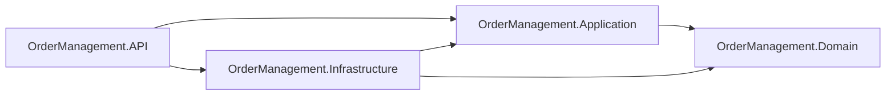

# OrderManagement

Backend para gerenciamento de pedidos, com foco em organização, manutenibilidade e testabilidade.

## Visão da Arquitetura

A solução segue os princípios da **Clean Architecture**, em que as dependências sempre apontam para as camadas mais internas da aplicação.

- `Domain` não depende de nenhuma outra camada.
- `Application` depende apenas de `Domain`.
- `Infrastructure` depende de `Application` e `Domain`.
- `API` depende de `Application` e `Infrastructure`, sendo a última utilizada para configuração da aplicação (injeção de dependências, banco de dados, logging, etc.).



## Estrutura da Solução

```text
OrderManagement.sln
├── src/
│   ├── API/
│   │   └── OrderManagement.API/                 (ASP.NET Core Web API - .NET 10)
│   ├── Application/
│   │   └── OrderManagement.Application/         (Class Library - .NET 10)
│   ├── Domain/
│   │   └── OrderManagement.Domain/              (Class Library - .NET 10)
│   └── Infrastructure/
│       └── OrderManagement.Infrastructure/      (Class Library - .NET 10)
└── tests/
    ├── OrderManagement.UnitTests/               (xUnit)
    └── OrderManagement.IntegrationTests/        (xUnit + WebApplicationFactory)
```

## Projetos

- `OrderManagement.API`
- `OrderManagement.Application`
- `OrderManagement.Domain`
- `OrderManagement.Infrastructure`
- `OrderManagement.UnitTests`
- `OrderManagement.IntegrationTests`

## Dependências entre Projetos

- `OrderManagement.Application` -> `OrderManagement.Domain`
- `OrderManagement.Infrastructure` -> `OrderManagement.Application`
- `OrderManagement.Infrastructure` -> `OrderManagement.Domain`
- `OrderManagement.API` -> `OrderManagement.Application`
- `OrderManagement.API` -> `OrderManagement.Infrastructure`
- `OrderManagement.UnitTests` -> `OrderManagement.Domain`, `OrderManagement.Application`
- `OrderManagement.IntegrationTests` -> `OrderManagement.API`

## Stack de Testes

- Unit Tests: `xUnit`
- Integration Tests: `xUnit` + `Microsoft.AspNetCore.Mvc.Testing` (`WebApplicationFactory`)

## OpenAPI

A API utiliza `Swashbuckle.AspNetCore` para geração da documentação OpenAPI/Swagger.

## Comandos Úteis

```bash
dotnet restore OrderManagement.sln
dotnet build OrderManagement.sln
dotnet test OrderManagement.sln
dotnet run --project src/API/OrderManagement.API/OrderManagement.API.csproj
```

## Observações de Versionamento

- O repositório está configurado com `.gitignore` para não versionar arquivos de build e artefatos temporários (`bin`, `obj`, arquivos de IDE e resultados de teste).