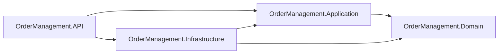

# OrderManagement

Backend para gerenciamento de pedidos, com foco em organização, manutenibilidade e testabilidade.

## Visão da Arquitetura



A solução segue os princípios da **Clean Architecture**, em que as dependências sempre apontam para as camadas mais internas da aplicação.

- `Domain` não depende de nenhuma outra camada.
- `Application` depende apenas de `Domain`.
- `Infrastructure` depende de `Application` e `Domain`.
- `API` depende de `Application` e `Infrastructure`, sendo a última utilizada para configuração da aplicação (injeção de dependências, banco de dados, logging, etc.).

## Estrutura da Solução

```text
OrderManagement.sln
├── API/
│   └── OrderManagement.API/                 (ASP.NET Core Web API - .NET 10)
├── Application/
│   └── OrderManagement.Application/         (Class Library - .NET 10)
├── Domain/
│   └── OrderManagement.Domain/              (Class Library - .NET 10)
└── Infrastructure/
    └── OrderManagement.Infrastructure/      (Class Library - .NET 10)
```